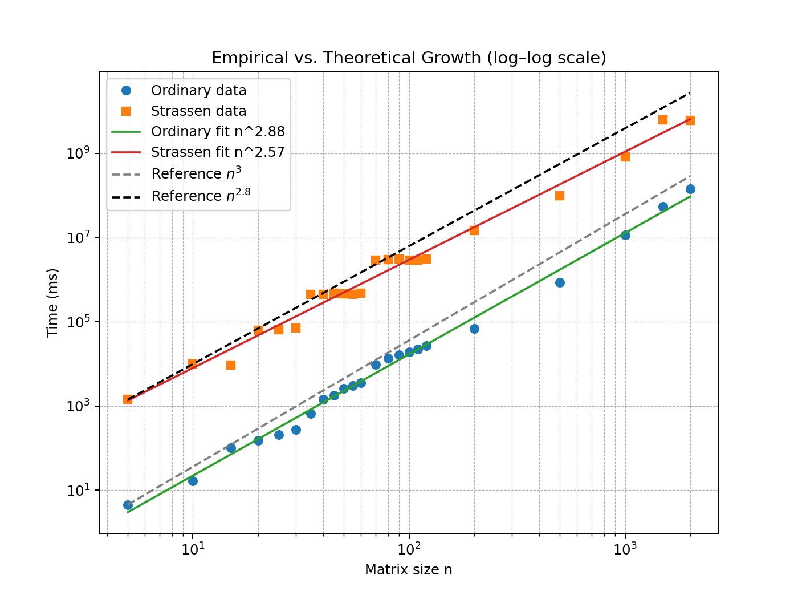

# Lab 1 : Matrix Multiplication Algorithms

**Course:** CS20009.04 Data Structure
**Name:** Yijia Chen
**Student Number:** 24300240127
**Date:** October 10, 2025

 

## Abstract

This lab implements and compares the performance of two matrix multiplication algorithms: the ordinary algorithm and Strassen's algorithm. Their theoretical complexities are $O(n^3)$ and $O(n^{2.81})$ respectively. Empirical results show that the running time of Strassen's algorithm grows slower than the ordinary algorithm for larger matrix sizes.

 

## Introduction

Matrix multiplication is a fundamental operation in linear algebra and computer science. The complexity of ordinary matrix multiplication algorithm is $O(n^3)$, where $n$ is the size of the matrices. This complexity is quite high, especially for large matrices. However, there are more efficient algorithms for matrix multiplication, such as Strassen's algorithm, which has a complexity of $O(n^{2.81})$. This lab evaluates and compares the performance of Strassen’s algorithm and the ordinary algorithm through empirical testing.

 

## Implementation

### Ordinary Algorithm

Given two $n \times n$ matrices $A$ and $B$, we want to figure out the matrix product $C = AB$. The ordinary algorithm follows the definition of matrix multiplication. The entry $c_{ij}$ for $i,j=1,2,\dots,n$ is computed by $$c_{ij} = \sum_{k=1}^{n} a_{ik}b_{kj}.$$

Because of the triply-nested loops, the  ordinary algorithm takes $O(n^3)$ time.

### Strassen's Algorithm

Strassen's algorithm accelerates matrix multiplication by recursively compute $7$ subproducts instead of $8$, as in the naive divide-and-conquer algorithm which breaks the $n \times n$ matrix into $8$ $\frac{n}{2} \times \frac{n}{2}$ matrices.

Suppose each of the $n \times n$ matrices $A$, $B$, and $C$ are divided as

$$
A = \begin{pmatrix} A_{11} & A_{12} \\ A_{21} & A_{22} \end{pmatrix}, \quad 
B = \begin{pmatrix} B_{11} & B_{12} \\ B_{21} & B_{22} \end{pmatrix}, \quad 
C = \begin{pmatrix} C_{11} & C_{12} \\ C_{21} & C_{22} \end{pmatrix}.
$$

To compute $C$, we recursively compute the following $7$ $\frac{n}{2} \times \frac{n}{2}$ matrix products.

$$
\begin{align}
P_1 &=& A{11} \cdot (B_{12} - B_{22}),\\
P_2 &=& (A_{11} + A_{12}) \cdot B_{22},\\
P_3 &=& (A_{21} + A_{22}) \cdot B_{11},\\
P_4 &=& A_{22} \cdot (B_{21} - B_{11}),\\
P_5 &=& (A_{11} + A_{22}) \cdot (B_{11} + B_{22}),\\
P_6 &=& (A_{12} - A_{22}) \cdot (B_{21} + B_{22}),\\
P_7 &=& (A_{11} - A_{21}) \cdot (B_{11} + B_{12}).
\end{align}
$$

Then, it can be verified that

$$
\begin{align}
C_{11} &=& P_5 + P_4 - P_2 + P_6,\\
C_{12} &=& P_1 + P_2,\\
C_{21} &=& P_3 + P_4,\\
C_{22} &=& P_5 + P_1 - P_3 - P_7.
\end{align}
$$

gives the result of $C = \begin{pmatrix} C_{11} & C_{12} \\ C_{21} & C_{22} \end{pmatrix}$.

<!-- @import ".\matrixmult.h" -->

 

## Experiment

To approximate the empirical complexity, a benchmarking program is implemented, which runs the algorithms with varied matrix sizes from $5$ to $120$. The inputs of the matrix multiplication procedures are generated randomly throughout the experiment, but remain the same for both algorithms each run. The test of each input size is carried out $100$ or $500$ times to eliminate the impact of randomness of an individual run.

<!-- @import ".\test100.cc" -->

The output of each run is saved in an electronic table file. Due to runtime and hardware limitations, the experiments were carried out in separate runs. Input sizes $5,10,15,20,25,30,35,40,45,50,55,60$ were run $500$ times each, recorded in `matrix_times_5_60.csv`. Input sizes $70,80,90,100,110,120$ were run $200$ times each, recorded in `matrix_times_70_120.csv`. Input size $200$ was run $100$ times for the ordinary algorithm and $55$ times for Strassen's algorithm, recorded in `matrix_times_200.csv`. Note that the average running time, which appear in the second and third columns of the tables, were calculated using Excel separately after the benchmarking program terminates.

 

Matrix multiplication is quite slow for large matrix sizes. To ensure the stability of my personal laptop computer and the benchmarking program, input size 500, 1000, 1500, 2000 were run separately, for 50, 8, 4, and 4 times each. Correspondingly, the benchmarking program is revised to output the timing data immediately. The results were saved in `matrix_times_500.csv`, `matrix_times_1000.csv`, and`matrix_times_1500.csv`. 

<!-- @import ".\test1500.cc" -->

 

## Analysis

We want to show that both of the running time of these two algorithms follow a polynomial growth, which is $$T(n) = c \cdot n^a.$$

Take logs of both sides, $$\lg T(n) = \lg c + a \lg n,$$ and we get a linear relationship between $\lg T(n)$ and $\lg n$.

The following code in Python can be used to plot the empirical growth against the theoretical growth. Log-log plot is adopted to visualize the relationship in straight lines. The slopes of the straight lines correspond to the desired $a$ in the exponent. The theoretical growth of $n^3$ and $n^{2.81}$ are exhibited in the same plot for comparison.

<!-- @import ".\curve.py" -->

According to the plot, the ordinary algorithm fits in $n^{2.88}$, and Strassen's algorithm fits in $n^{2.57}$.

$2.57 < 2.88$ indicates that Strassen's algorithm runs faster than the ordinary algorithm for larger matrix sizes, which aligns with theoretical growth trend. However, the fitted exponents are lower than the theoretical $3$ and $2.81$.

 

## Discussion

The empirical result does not fit in the theoretical growth very closely, which is attributed to many reasons.

Firstly, the scale of the test is limited in comparison with the crossover point of Strassen's algorithm. Although the lab specification says that Strassen’s algorithm outperforms the conventional cubic-time algorithm for input sizes $n ≥ 32$ on contemporary computing machinery, it differs greatly from the experiment data. For example, when input size is $1000$, the ordinary algorithm takes $11452375.5$ microseconds on average, while the average running time of Strassen’s algorithm is $833197238.6$ microseconds. According to D'Alberto and Nicolau, the crossover points range from $n=400$ to $n=2150$ on different systems, and may not exist on some machines. Because of hardware and time constraints, the crossover point was not reached. Strassen's algorithm performs $7$ recursive multiplications and multiple additions and subtractions of matrices. Function call overheads and the frequent memory allocation result in larger constant factors and low order terms. They are likely to dominate the running time when the input size is small, leading to the poor fit.

The log-log plot exhibits a "staircase" pattern arouund input size $50$ and $100$ instead of a smooth curve. This might be caused by the memory hierarchy. With the growth of input matrix size, data may exceed certain memory levels like L1, L2, or L3 cache. This guess remains to be further investigated.

In addition, other uncontrolled factors exist. On a modern operating system such as Windows 11, background processes and scheduling policies can introduce timing noise that undermines microsecond-level accuracy. Since program optimization and scheduling are largely opaque to the user, the measured runtime reflects only a general trend rather than an exact performance profile.

 

## Conclusion

Although Strassen's algorithm did not outperform the ordinary matrix multiplication algorithm with small input size, the experimental trend aligns with its lower complexity. With larger matrices and optimized implementation, its advantage would become more evident.

 

## References

Cormen, T. H., Leiserson, C. E., Rivest, R. L., and Stein, C. (2009).
    *Introduction to Algorithms* (3rd ed.). MIT Press.

 

## Acknowledgement

ChatGPT-5 offered helpful guidance on generating random numbers, measuring the running time in C++, ploting results with Matplotlib and refining the writing for clarity and correctness.

> https://chatgpt.com/s/t_68d1f697dc9c8191aab672cd50b08c5f
> https://chatgpt.com/s/t_68d1f613548c81918a8bf7a13fd3881b
> https://chatgpt.com/s/t_68e720126b908191b321b0e0da699558

 

## Appendix : Lab specification

### Abstract

In the present laboratory exercise, you are instructed to implement two distinct methods for **matrix multiplication**: **Strassen’s algorithm** and **ordinary algorithm**. You are encouraged to undertake a comprehensive analysis of both algorithms, encompassing both theoretical frameworks and empirical validation through experimentation.

### 1 Introduction

The Strassen algorithm, attributed to Volker Strassen, represents an enhanced approach to matrix multiplication, utilizing a divide-and-conquer strategy for optimization. The algorithm exhibits a computational complexity of $Θ(n^2.81)$ as opposed to $Θ(n^3)$. While the difference between $2.81$ and $3$ may appear negligible, it is important to note that this variation occurs in the exponent, thereby leading to a substantial impact on the algorithm’s running time. In practical terms, Strassen’s algorithm outperforms the conventional cubic-time algorithm for input sizes $n ≥ 32$ on contemporary computing machinery.

### 2 The Tasks

#### 2.1 Implementation
Write code for Strassen’s and ordinary algorithms.

#### 2.2 Experiment
Evaluate the empirical cost associated with the implementation of the algorithms to determine its alignment with the theoretical computational complexity.

#### 2.3 Documentation
All document for the answers of the above questions.

### 3 Points for Attention
(1) For the implementation of these algorithms, you are free to select a programming language of your choice.
(2) Kindly upload the source code files along with their associated documentation in a compressed ZIP format to the elearning system for assessment.
(3) The deadline of this lab is *23:59:59 on October 10*.
(4) If you have any questions please feel free to contact teaching assistants.