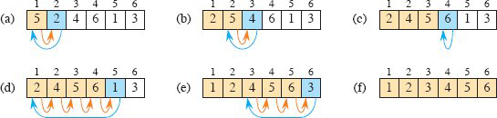
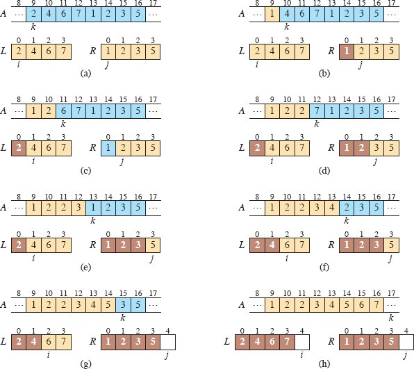
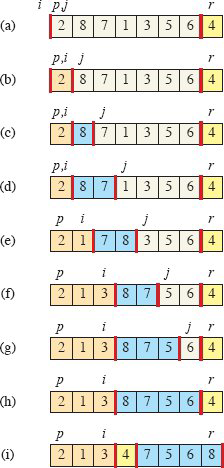
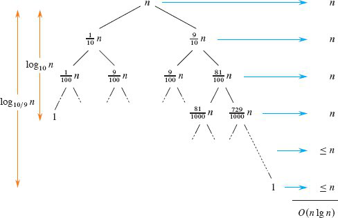
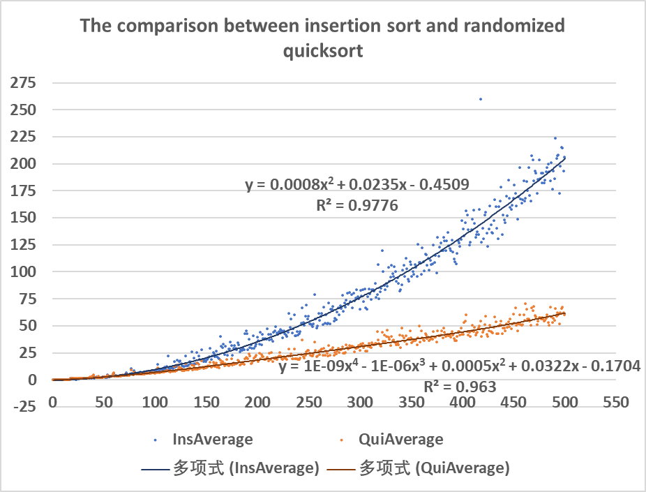
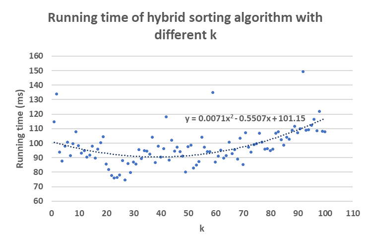

# Project 1 : Basic Sorting Algorithms and Hybrid Optimization

**Course:** CS20009.04 Data Structure
**Name:** Yijia Chen
**Student Number:** 24300240127
**Date:** September 26, 2025

 

## Introduction

Sorting is widely used in many programs as an intermediate step. Therefore, it's necessary to analyze the efficiency of different kinds of sorting algorithms, and choose an appropriate type in application.

This project aims to:

-  Implement insertion sort, mergesort, and quicksort in C++.
-  Analyze and compare their efficiency, both in theory and by experiment.
-  Combine the advantages of these sorting algorithms to optimize the performance.

 

## Implementation of Sorting Algorithms

### Insertion Sort

Insertion sort maintains a sorted prefix `a[1..j-1]`, and insert the current element `a[j]` into it by comparing and exchanging it with its previous element repeatedly until `a[j] > a[j-1]`.

 

### Mergesort

Mergesort follows the *divide-and-conquer* method: divide the array into two subarrays, conquer them recursively using `mergeSort`, and combine these two sorted subarrays using the auxiliary procedure `merge`.

 

### Randomized Quicksort

`partition` divides the array into two parts: all elements in one part is less than `pivot`, and all elements in the other part is greater than `pivot`. Then it recursively calls `quickSort` on the two subarrays.

<!-- @import ".\sort.h" -->

 

## Theoretical Analysis

### Running Time of the Hybrid Algorithm

| Algorithm       | Time $O(\cdot)$ |
|--|--|
| `insertionSort` | $n^2$           |
| `mergeSort`     | $n\lg n$        |
| `quickSort`     | $n\lg n$        |

In the hybrid algorithm, `quickSort` is called recursively on subarrays with more than $k$ elements. Subarrays with fewer than $k$ elements, which are left unsorted by the recursive calls of `quickSort`, are subsequently sorted by a single call to `insertionSort` directly. This takes the advantage of speediness `insertionSort` when input scale is relatively small.

Consider the recursive tree of `quickSort`. 

Suppose the `partition` procedure always splits input into subarrays of sizes in a fixed 9:1 ratio, as shown in the diagram. On every level, the sum of subarray sizes $\leq n$. In particular, if none of the subproblems reaches the base case and the recursive branch terminates, then the subarrays form a partition of the original array, and their sizes add up to exactly $n$, corresponding to the top $\log_{10}n$ levels in this example.

Therefore, recursive function calls on every level takes $O(n)$ time. In the hybrid algorithm, `quickSort` only applies to $\log_k n = \lg (n/k)$ levels from the top, whose expected running time is $O(n \lg (n/k))$.

When `quickSort` halts, the array is partitioned into approximately $n/k$ unsorted subarrays, each sized $\leq k$. The operations of `insertionSort` on the whole array is equivalent to calling `insertionSort` on the $n/k$ arrays separately, because comparison between any two elements in different subarrays is unnecessary after `partition`. Let $l_i$ be the length of the $i^{th}$ subarray, where $0 \leq l_i \leq k$ and $\sum_{i} l_i = n$. Using `insertionSort` to sort these subarrays takes $$\sum_i O(l_i^2) \leq \sum_i O(k\cdot l_i) = O(\sum_i k\cdot l_i) = O(nk).$$

Combine the running time of `quickSort` and `insertionSort` above, Therefore, the hybrid sorting algorithm runs in $$O(n \lg (n/k)) + O(nk) = O(nk + n\lg(n/k))$$ expected time.

 

### Naive Deduction on $k$

Let $f(k) = nk + n\log_2(n/k)$, where $n$ is treated as a constant, and $k$ is a continuous positive variable.
$$f'(k) = n + n \cdot (-\frac{1}{k \ln 2}) = n \cdot (1 - \frac{1}{k \ln 2})$$

Set $f'(k) = 0$. The critical point $k^* = \frac{1}{\ln 2} \approx 1.4427$.

Since $$f''(k) = \frac{1}{k^2 \ln 2} > 0 ,\text{ for } k > 0,$$  the critical point $k^*$ is a strict local minimum.

Because the input size $k$ of `insertionSort` must be a positive integer, this simplified model suggests $k=1$ or $k=2$ as candidates.

However, this result is quite misleading, mainly because the big-O notation $O(nk + n\lg(n/k))$ ignores constant factors and discards lower-order terms, which dominates when $k$ is small. Recursive function calls in `quickSort` introduce overhead, making its constant coefficients much greater than the simple iterative structure of `insertionSort`. Thus, the asymptotic analysis does not make sense to determine the threshold for the hybrid algorithm.

 

## Experimental Analysis

To choose the value of $k$, the objective is to identify the input size at which randomized quicksort begins to outperform insertion sort.

A benchmarking program is implemented to compare insertion sort and randomized quicksort over input sizes ranging from 1 to 500. The test is run 500 times, and the results are automatically saved in "results.csv".

<!-- @import ".\test100chat.cc" -->

To visualize the results, I used Excel to compute the averages and generate a scattered plot to gain insight into the data. 

From the diagram, we conclude that the running time of  insertion sort curves into $$y = 0.008x^2+0.0235x-0.4509,$$ while randomized quicksort is $$y = 1\times10^{-9} x^4 - 1\times10^{-6} x^3 + 0.0005x^2 + 0.0322x - 0.1704.$$ The formula of quicksort does not exactly fit into the pattern of $n\lg n$, primarily due to limitations of Excel's curve-fitting functions. Fortunately, $R^2 = 0.963$, which indicates that the curve is relatively accurate.

Solve the equation $$0.008x^2+0.0235x-0.4509 = 1\times10^{-9} x^4 - 1\times10^{-6} x^3 + 0.0005x^2 + 0.0322x - 0.1704,$$ and we obtain the intersection point $$x = 44.0459.$$ Insertion sort is faster when $x<44.0459$, and quicksort is faster when $x>44.0459$. It can be inferred that a possible choice of $k$ in the hybrid sorting algorithm is around 44.

 

## Hybrid Quicksort with Insertion Sort

### The Choice of $k$ by experiment

To determine the value of $k$ that yields the highest efficiency, the following experiment was conducted. It runs the test 1000 times with a fixed input size 1000 and $k$ ranging from $1$ to $100$.

<!-- @import ".\testK.cc" -->

According to the scattered plot, where each point represents the average running time for the given $k$, we obtain the formula $$y = 0.0071x^2 - 0.5507x + 101.15 = 0.0071 (x - 38.7817)^2 + 90.4715.$$ The function has a strict minimum value of $90.4715$ at $x = 38.7817$. The optimal integer choice of $k$ is $38$ or $39$.

 

### Implementation of the Hybrid Algorithm

<!-- @import ".\hybridSort.h" -->

 

## Discussion

Despite the result, the project is subject to several limitations.

First, the scale of the test is limited. For feasibility, each configuration was only tested 1000 times, which is insufficient to get convincing results. The test was only implemented on a single machine, which limits the generalizability of the results.

In addition, the experiment lacks a precise methodology of measuring the performance of an algorithm. In this experiment, the performance of insertion sort and randomized quicksort is depicted by the running time recorded in millisecond. On a sophisticated operating system like Windows 11, background processes may introduce noise that undermines the precision of millisecond-level timing. The optimization and scheduling of the testing program by the operating system is hardly known from a programmer's perspective. In other words, the performance of the algorithms presented by the experiment merely indicates an ambiguous trend.

Due to these uncontrolled factors, improved statistical analysis is necessary. For example, the outliers need to be removed from the data, instead of being taken into account in the average calculation.

Algorithm analysis puts emphasis on the number of operations that a program makes, independent of the particular machine, compiler optimization and OS scheduling. In the implementation of this project, these factors are scarcely taken into account.

Last but not least, in real-life application, the sequence to sort usually follows a certain pattern. For example, insertion sort is fast when the input is nearly sorted. All experiments in this project were conducted using uniformly distributed random integers.

 

## Conclusion

In the hybrid sorting algorithm, the choice of $k$ is approximately 39, which aligns closely with practical implementations that select $k$ between 10 and 30. A practical approach is to combine the strengths of different basic algorithms to obtain an algorithm that adapts efficiently to diverse input characteristics.

 

## References

Cormen, T. H., Leiserson, C. E., Rivest, R. L., and Stein, C. (2022).
    *Introduction to Algorithms* (4th ed.). MIT Press.

 

## Acknowledgement

ChatGPT-5 provided valuable suggestions about generating random numbers, measuring the running time in C++ and correcting spelling mistakes in my writing.

> https://chatgpt.com/s/t_68d1f697dc9c8191aab672cd50b08c5f
> https://chatgpt.com/s/t_68d1f613548c81918a8bf7a13fd3881b

 

## Appendix : Project specification

1. Write code for insertion sort. (10 points)

2. Write code for mergesort. (10 points)

3. Write code for quicksort. (10 points)

4. The running time of quicksort can be improved in practice by taking advantage of the fast running time of insertion sort when its input is “nearly” sorted. When quicksort is called on a subarray with fewer than $k$ elements, let it simply return without sorting the subarray. After the top-level call to quicksort returns, run insertion sort on the entire array to finish the sorting process.
   Argue that this sorting algorithm runs in $O(nk + n \text{lg}(n/k))$ expected time. How should $k$ be picked, both in theory and in practice by experiments? (30 points)

5. Write code for improved version of sorting algorithm which combines quicksort with insertion sort. (20 points)

6. All document for the answers of the above questions. (20 points)
