# Project 2 : Chinese-English Dictionary based on Binary Search Tree

**Course:** CS20009.04 Data Structure
**Name:** Yijia Chen
**Student Number:** 24300240127
**Date:** November 20, 2025


<br>

## Introduction

AVL trees and Red-Black trees are both binary search trees that are self-balancing. Although AVL trees and Red-Black trees both guarantee `O(lgn)` time operations, AVL trees tend to be more rigidly balanced and may offer slightly faster lookups, at the cost of more complex rotations. Red-Black trees are easier to implement and usually incur fewer rebalancing operations.

This project is to implement a Chinese-English dictionary based on both AVL trees and Red-Black trees. The program reads a file containing Chinese-English translations and stores them in a dictionary. It then adds additional translations to the dictionary. It allows the user to search for a word or a range of words.

<br>

## Implementation of AVL Tree

To keep the binary search tree balanced, the *AVL tree property* is maintained that the height of the left and right subtrees can differ by at most 1. The height of a node is defined as the maximum height of its left and right subtree plus one. The balance factor of a node is the height of its left subtree minus the height of its right subtree. In other words, if the balance factor is -1, 0, or 1, the AVL tree property is satisfied.


An `AVLNode` stores the key, meaning, height, and pointers to its parent, left child, and right child.

<!-- @import "avl_tree.h" -->

First, we implement the constructor, destructor, and some auxiliary functions. We need `balance_factor` to calculate the balance factor, because AVL trees require that for every node, the height of its left subtree and right subtree differ by at most one.

```cpp
// Return the larger of two integers
static inline int maxint(int a, int b) { return a > b ? a : b; }

// Constructor: Initialize root node to null
AVLTree::AVLTree() : root(nullptr) {}
// Destructor: Destroy the entire tree
AVLTree::~AVLTree() { destroy(root); }

// Recursively destroy subtree rooted at x
void AVLTree::destroy(AVLNode *x) {
    if (!x) return;
    destroy(x->left);
    destroy(x->right);
    delete x;
}

// Get the height of a node, return 0 if node is null
int AVLTree::height(AVLNode *n) const { return n ? n->height : 0; }

// Calculate balance factor (left subtree height - right subtree height)
int AVLTree::balance_factor(AVLNode *n) const {
    return n ? height(n->left) - height(n->right) : 0;
}
```

Next, we implement two *rotation* operations. Rotations restore balance after insertions or deletions when the tree’s height difference exceeds ±1 by changing the pointer structure locally. `rotate_right` and `rotate_left` are symmetric.

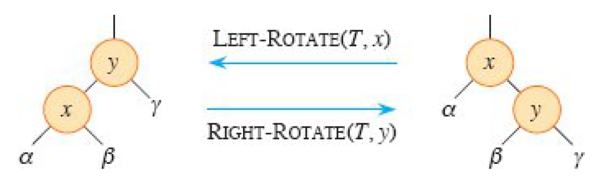

```cpp
// ---------- Rotations ----------
// Right rotation operation: used to handle left-left case
AVLNode* AVLTree::rotate_right(AVLNode* y) {
    AVLNode* x = y->left;       // x becomes new root of this subtree
    AVLNode* T2 = x->right;     // T2 is x's right subtree. It will become y->left.

    x->right = y;   // y moves down to the right child of x
    y->left = T2;   // T2 is now the left child of y

    y->height = 1 + maxint(height(y->left), height(y->right));
    x->height = 1 + maxint(height(x->left), height(x->right));

    return x;
}

// Left rotation operation: used to handle right-right case
AVLNode* AVLTree::rotate_left(AVLNode* x) {
    AVLNode* y = x->right;
    AVLNode* T2 = y->left;
    y->left = x;
    x->right = T2;
    x->height = maxint(height(x->left), height(x->right)) + 1;
    y->height = maxint(height(y->left), height(y->right)) + 1;
    return y;
}
```

Both insertion and deletion may violate the AVL tree property, because the height of the left or right subtree may differ by two. We can fix this violation by performing rotations.

Then implement the *insertion* operation. At the beginning, we simply insert the node into the tree according to the key value. After that, we check the balance factor of the node and perform rotations to maintain the AVL tree property.

```cpp
// ---------- Insert ----------
// Insert key-value pair into AVL tree
void AVLTree::insert(const std::string &key, const std::string &meaning) {
    root = insert_rec(root, key, meaning);
}

// Recursive node insertion
AVLNode* AVLTree::insert_rec(AVLNode* node, const std::string &k, const std::string &m) {
    // Standard BST insert
    // If current node is null, create new node
    if (!node) return new AVLNode(k, m);

    // Decide whether to insert into left or right subtree based on key value
    if (k < node->key)
        node->left = insert_rec(node->left, k, m);
    else if (k > node->key)
        node->right = insert_rec(node->right, k, m);
    else {
        node->meaning = m;  // Update existing key value
        return node;
    }

    // Update node height
    node->height = 1 + maxint(height(node->left), height(node->right));
    // Calculate balance factor
    int bf = balance_factor(node);

    // Perform rotations based on different imbalance situations
    // Left Left case
    if (bf > 1 && k < node->left->key)
        return rotate_right(node);
    // Right Right case
    if (bf < -1 && k > node->right->key)
        return rotate_left(node);
    // Left Right case
    if (bf > 1 && k > node->left->key) {
        node->left = rotate_left(node->left);
        return rotate_right(node);
    }
    // Right Left case
    if (bf < -1 && k < node->right->key) {
        node->right = rotate_right(node->right);
        return rotate_left(node);
    }
    return node;            // new root of the subtree
}
```

After that, we implement the *deletion* operation. Similar to insertion, we first find the node to delete and delete it. Then we check the balance factor of the node and perform rotations to maintain the AVL tree property. The fixup includes four cases:

| Four types       | Rotation                | Figure |
|------------------|-------------------------|--|
| Case 1: Left-left | Right rotation          |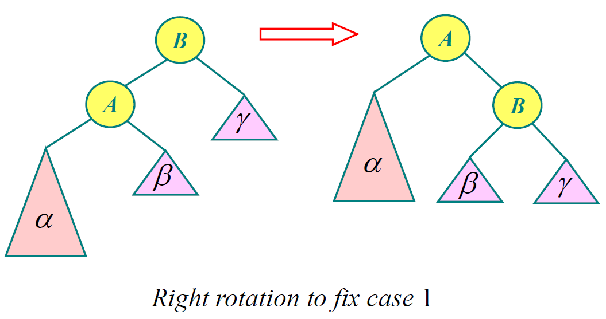|
| Case 4: Right-right | Left rotation         |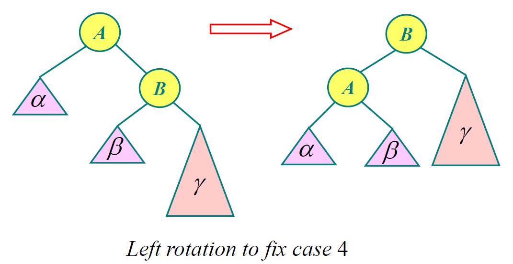|
| Case 2: Left-right | Left-right double rotation |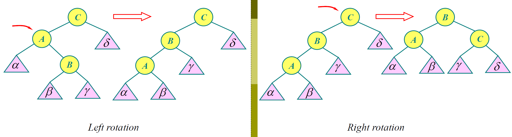|
| Case 3: Right-left | Right-left double rotation |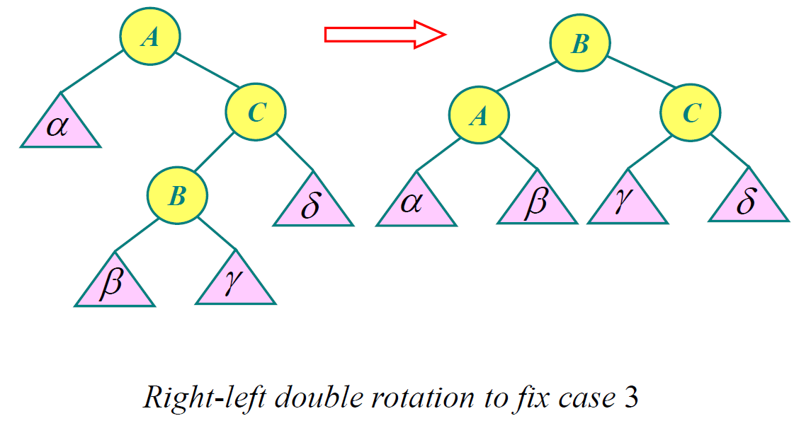|

```cpp
// ---------- Delete ----------
// Delete specified key value from AVL tree
void AVLTree::remove(const std::string &key) {
    root = remove_rec(root, key);
}

// Find the minimum node in subtree rooted at node
AVLNode* AVLTree::min_node(AVLNode* node) const {
    AVLNode* cur = node;
    while (cur && cur->left)
        cur = cur->left;
    return cur;
}

// Recursive node deletion
AVLNode* AVLTree::remove_rec(AVLNode* node, const std::string &k) {
    // If node is null, return directly
    if (!node) return node;

    // Standard BST search
    if (k < node->key)
        node->left = remove_rec(node->left, k);
    else if (k > node->key)
        node->right = remove_rec(node->right, k);
    else {
        // Found node to delete
        if (!node->left || !node->right) {  // Node has at most one child
            AVLNode* child = node->left ? node->left : node->right;
            if (!child) {    // No children, leaf
                delete node;
                return nullptr;
            } else {        // One child, replace node by child
                AVLNode* old = node;
                node = child;     // promote child
                delete old;       // remove old node
            }
        } else {            // Node has two children
            AVLNode* succ = min_node(node->right);
            node->key = succ->key;
            node->meaning = succ->meaning;
            node->right = remove_rec(node->right, succ->key);
        }
    }

    // Update node height
    node->height = 1 + maxint(height(node->left), height(node->right));
    // Calculate balance factor
    int bf = balance_factor(node);

    // Perform rotations based on different imbalance situations
    if (bf > 1 && balance_factor(node->left) >= 0)
        return rotate_right(node);
    if (bf > 1 && balance_factor(node->left) < 0) {
        node->left = rotate_left(node->left);
        return rotate_right(node);
    }
    if (bf < -1 && balance_factor(node->right) <= 0)
        return rotate_left(node);
    if (bf < -1 && balance_factor(node->right) > 0) {
        node->right = rotate_right(node->right);
        return rotate_left(node);
    }

    return node;            // new root of the subtree
}
```

Finally, we implement the *search* operation. `search` searches for the node with the specified key value. `range_search` searches for all nodes within the specified range. The search operations take advantage of the binary search tree property, where the key value of each node is greater than or equal to all the key values in its left subtree and less than or equal to all the key values in its right subtree.

```cpp
// ---------- Search ----------
// Search for node with specified key value in AVL tree
AVLNode* AVLTree::search(const std::string &key) const {
    AVLNode* cur = root;
    while (cur) {
        if (key == cur->key) return cur;
        cur = (key < cur->key) ? cur->left : cur->right;
    }
    return nullptr;
}

// ---------- Range Search ----------
// Find all nodes within specified range
void AVLTree::range_search(const std::string &low, const std::string &high, std::vector<AVLNode*> &out) const {
    // Use lambda expression to implement depth-first search
    std::function<void(AVLNode*)> dfs = [&](AVLNode* node) {
        if (!node) return;
        if (node->key > low) dfs(node->left);
        if (node->key >= low && node->key <= high) out.push_back(node);
        if (node->key < high) dfs(node->right);
    };
    dfs(root);
}

// ---------- Preorder Print ----------
// Preorder traversal print AVL tree structure to file
void AVLTree::preorder_print(const std::string &outpath) const {
    std::ofstream out(outpath);
    if (!out) {
        std::cerr << "Cannot open " << outpath << "\n";
        return;
    }
    preorder_rec(root, 0, 0, out);
}

// Recursive preorder traversal print node information
void AVLTree::preorder_rec(AVLNode *node, int level, int childIndex, std::ofstream &out) const {
    if (!node) {
        out << "level=" << level << " child=" << childIndex << " null\n";
        return;
    }
    out << "level=" << level << " child=" << childIndex << " "
        << node->key << "(h=" << node->height << ")\n";
    preorder_rec(node->left, level + 1, 0, out);
    preorder_rec(node->right, level + 1, 1, out);
}
```

<br>

## Implementation of Red-Black Tree

A red-black tree is a binary search tree that satisfies the following *red-black properties*:

1. Every node is either red or black.
2. The root is black.
3. Every leaf (NIL) is black.
4. If a node is red, then both its children are black.
5. For each node, all simple paths from the node to descendant leaves contain the same number of black nodes. The number of black nodes on any simple path from, but not including, a node x down to a leaf is called the *black-height* of the node.

The `RBNode` differs from the AVL node in that it has a `color` field instead of a `height` field. In the `RBTree` class, we use a sentinel node `NIL` to represent the leaf node.

<!-- @import "rb_tree.h"-->

First, we implement the constructor and destructor.

```cpp
RBTree::RBTree() {
    NIL = new RBNode();
    NIL->color = BLACK;
    NIL->left = NIL->right = NIL->parent = NIL;
    root = NIL;
}
RBTree::~RBTree() {
    destroy(root);
    delete NIL;
}

void RBTree::destroy(RBNode *x) {
    if (x == NIL) return;
    destroy(x->left);
    destroy(x->right);
    delete x;
}
```


Similar to AVL tree, we implement the *rotation* operation to maintain the Red-Black tree property. The difference is that we should check whether `y->left` or `x->parent` is `NIL`.

```cpp
// ---------- Rotations ----------
void RBTree::left_rotate(RBNode *x) {
    RBNode *y = x->right;      // y is x's right child
    x->right = y->left;        // turn y’s left subtree into x’s right subtree

    // If y->left is a real node (not NIL), update its parent
    if (y->left != NIL)
        y->left->parent = x;

    // Link y's parent to x's parent
    y->parent = x->parent;

    // If x was the root, now y becomes new root
    if (x->parent == NIL)
        root = y;
    // Otherwise reconnect x's parent to y
    else if (x == x->parent->left)
        x->parent->left = y;
    else
        x->parent->right = y;

    y->left = x;    // make x become y’s left child
    x->parent = y;
}

void RBTree::right_rotate(RBNode *y) {
    RBNode *x = y->left;
    y->left = x->right;
    if (x->right != NIL)
        x->right->parent = y;
    x->parent = y->parent;
    if (y->parent == NIL)
        root = x;
    else if (y == y->parent->right)
        y->parent->right = x;
    else
        y->parent->left = x;
    x->right = y;
    y->parent = x;
}
```

We insert the node into the tree and then fix the Red-Black tree property. A newly inserted node is colored red, because it is easier to fix the violation of property 2 and 4 than property 5. If the new node is colored black, every path through the new node would gain an extra black node, which is hard to fix.

| Types                | Types                                                         | Operation                     | Figure |
|---------------------|----------------------------------------------------------------|-------------------------------|---|
| $z$'s father is left child | Case 1L: $z$'s uncle is red.                                  | Change color:                 | 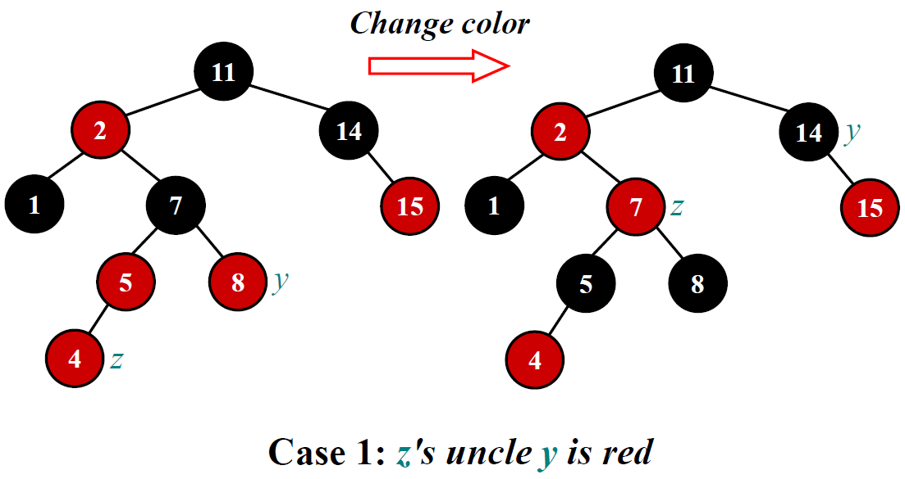 |
|                     | Case 2L: $z$'s uncle is black and $z$ is right child.         | Left rotation, $p(z)$.        | 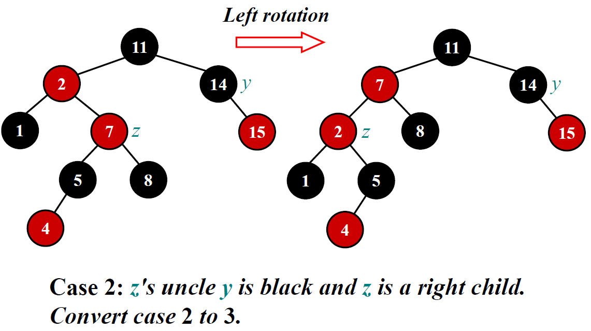 |
|                     | Case 3L: $z$'s uncle is black and $z$ is left child.          | Right rotation, $p(p(z))$.    | 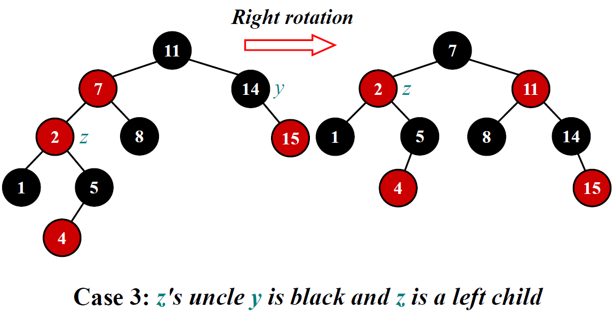 |
| $z$'s father is right child | Case 1R: $z$'s uncle is red.                                  | Change color:                 |
|                     | Case 2R: $z$'s uncle is black and $z$ is left child.          | Right rotation, $p(z)$.       |
|                     | Case 3R: $z$'s uncle is black and $z$ is right child.         | Left rotation, $p(p(z))$.     |


```cpp
// ---------- Insert ----------
void RBTree::insert(const std::string &key, const std::string &meaning) {
    // Create new red node
    RBNode *z = new RBNode(key, meaning, RED);
    z->left = z->right = z->parent = NIL;

    RBNode *x = root;   // node being compared with z
    RBNode *y = NIL;    // y will be parent of z

    // Standard BST insertion
    while (x != NIL) {
        y = x;
        if (z->key < x->key)
            x = x->left;
        else if (z->key > x->key)
            x = x->right;
        else {  // Key already exists — update meaning
            x->meaning = meaning;
            delete z;
            return;
        }
    }

    z->parent = y;      // found the location, insert z with parent y
    if (y == NIL)
        root = z;       // tree T was empty, first insertion
    else if (z->key < y->key)
        y->left = z;
    else
        y->right = z;

    insert_fixup(z);
}

void RBTree::insert_fixup(RBNode *z) {
    while (z->parent->color == RED) {
        // Parent is left child of grandparent
        if (z->parent == z->parent->parent->left) {
            RBNode *y = z->parent->parent->right;   // y is z's uncle

            if (y->color == RED) {
                // Case 1: parent & uncle red, recolor and move up
                z->parent->color = BLACK;
                y->color = BLACK;
                z->parent->parent->color = RED;
                z = z->parent->parent;              // move up the tree
            } else { // Uncle black
                if (z == z->parent->right) {
                    // Case 2: triangle, rotate to turn into line
                    z = z->parent;
                    left_rotate(z);
                }
                // Case 3: line, rotate and recolor
                z->parent->color = BLACK;
                z->parent->parent->color = RED;
                right_rotate(z->parent->parent);
            }
        }

        // Parent is right child (mirror of above)
        else {
            RBNode *y = z->parent->parent->left;

            if (y->color == RED) {
                z->parent->color = BLACK;
                y->color = BLACK;
                z->parent->parent->color = RED;
                z = z->parent->parent;
            } else {
                if (z == z->parent->left) {
                    z = z->parent;
                    right_rotate(z);
                }
                z->parent->color = BLACK;
                z->parent->parent->color = RED;
                left_rotate(z->parent->parent);
            }
        }
    }

    root->color = BLACK;  // root must always be black
}
```

We find and delete the node, and then restore the Red-Black tree property.

| Types           | Types                                                         | Operation                     | Figure |
|----------------|----------------------------------------------------------------|-------------------------------|--|
| $z$ is left child | Case 1L: $x$'s sibling $w$ is red.                            | Left rotation, $p(x)$.        | 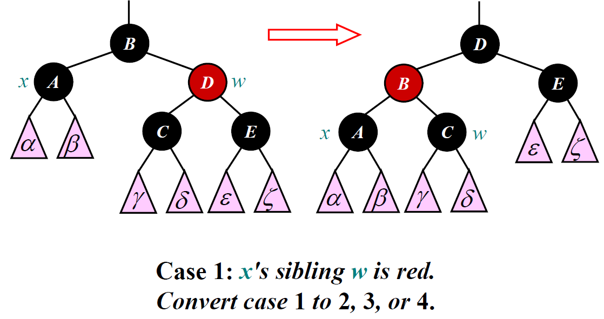 |
|                | Case 2L: $x$'s sibling $w$ is black and both of $w$'s children are black. | Change color:                 | 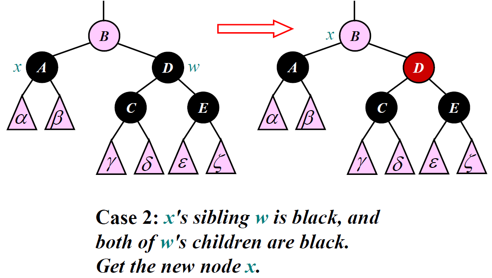 |
|                | Case 3L: $x$'s sibling $w$ is black, and $w$'s left children is red, and $w$'s right child is black. | Right rotation, $w$.          | 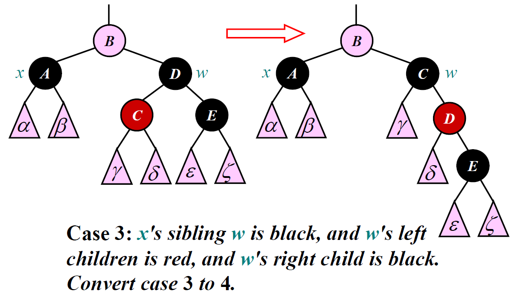 |
|                | Case 4L: $x$'s sibling $w$ is black, and $w$'s right child is red. | Left rotation, $p(x)$.        |  |
| $z$ is right child | Case 1R: $x$'s sibling $w$ is red.                            | Right rotation, $p(x)$.       |
|                | Case 2R: $x$'s sibling $w$ is black and both of $w$'s children are black. | Change color:                 |
|                | Case 3R: $x$'s sibling $w$ is black, and $w$'s right children is red, and $w$'s left child is black. | Left rotation, $w$.           |
|                | Case 4R: $x$'s sibling $w$ is black, and $w$'s left child is red. | Right rotation, $p(x)$.       |

```cpp
// ---------- Delete ----------
void RBTree::remove(const std::string &key) {
    RBNode *z = search(key);
    if (z == NIL) return;   // not found

    RBNode *y = z;      // node actually removed
    RBNode *x;          // subtree moved into y's old place
    Color y_orig_color = y->color;

    // Case 1: One or zero children
    if (z->left == NIL) {
        x = z->right;
        transplant(z, z->right);    // replace z by its right child
    }
    else if (z->right == NIL) {
        x = z->left;
        transplant(z, z->left);     // replace z by its left child
    }

    // Case 2: Two children
    else {
        y = tree_minimum(z->right);     // y is z's successor
        y_orig_color = y->color;
        x = y->right;

        if (y->parent == z) {           // x is T.nil
            if (x != NIL) x->parent = y;
        } else {                        // is y farther down the tree?
            transplant(y, y->right);    // replace y by its right child
            y->right = z->right;        // z’s right child becomes y’s right child
            if (y->right != NIL) y->right->parent = y;
        }

        transplant(z, y);   // replace z by its successor y
        y->left = z->left;  // give z’s left child to y, which had no left child
        if (y->left != NIL) y->left->parent = y;
        y->color = z->color;  // preserve black-height
    }

    // If we removed a black node, we must rebalance
    if (y_orig_color == BLACK)
        delete_fixup(x);
    
    // z has been detached from the tree
    delete z;
}

void RBTree::transplant(RBNode *u, RBNode *v) {
    if (u->parent == NIL)
        root = v;                       // u was root
    else if (u == u->parent->left)
        u->parent->left = v;
    else
        u->parent->right = v;

    if (v != NIL) v->parent = u->parent;
}

RBNode* RBTree::tree_minimum(RBNode *x) const {
    while (x->left != NIL)
        x = x->left;
    return x;
}

void RBTree::delete_fixup(RBNode *x) {
    while (x != root && x->color == BLACK) {

        // x is left child
        if (x == x->parent->left) {
            RBNode *w = x->parent->right;   // sibling

            // Case 1: sibling red
            if (w->color == RED) {
                w->color = BLACK;
                x->parent->color = RED;
                left_rotate(x->parent);
                w = x->parent->right;
            }

            // Case 2: sibling black, both children black
            if (w->left->color == BLACK && w->right->color == BLACK) {
                w->color = RED;
                x = x->parent;
            }

            // Case 3: sibling black, right child black, left child red
            else {
                if (w->right->color == BLACK) {
                    w->left->color = BLACK;
                    w->color = RED;
                    right_rotate(w);
                    w = x->parent->right;
                }

                // Case 4: sibling black, right child red
                w->color = x->parent->color;
                x->parent->color = BLACK;
                w->right->color = BLACK;
                left_rotate(x->parent);
                x = root;
            }
        }

        // Mirror: x is right child
        else {
            RBNode *w = x->parent->left;

            if (w->color == RED) {
                w->color = BLACK;
                x->parent->color = RED;
                right_rotate(x->parent);
                w = x->parent->left;
            }

            if (w->right->color == BLACK && w->left->color == BLACK) {
                w->color = RED;
                x = x->parent;
            }
            else {
                if (w->left->color == BLACK) {
                    w->right->color = BLACK;
                    w->color = RED;
                    left_rotate(w);
                    w = x->parent->left;
                }

                w->color = x->parent->color;
                x->parent->color = BLACK;
                w->left->color = BLACK;
                right_rotate(x->parent);
                x = root;
            }
        }
    }

    x->color = BLACK;   // ensure x is black
}
```

`search`, `range_search`, and `preorder_print` are implemented in the same way as the AVL tree.

```cpp
// ---------- Search ----------
RBNode* RBTree::search(const std::string &key) const {
    RBNode *cur = root;
    while (cur != NIL) {
        if (key == cur->key) return cur;
        cur = (key < cur->key) ? cur->left : cur->right;
    }
    return nullptr;
}

// ---------- Range Search ----------
void RBTree::range_search(const std::string &low, const std::string &high, std::vector<RBNode*> &out) const {
    std::function<void(RBNode*)> dfs = [&](RBNode* node) {
        if (node == NIL) return;
        if (node->key > low) dfs(node->left);
        if (node->key >= low && node->key <= high) out.push_back(node);
        if (node->key < high) dfs(node->right);
    };
    dfs(root);
}

// ---------- Preorder Print ----------
void RBTree::preorder_print(const std::string &outpath) const {
    std::ofstream out(outpath);
    if (!out) {
        std::cerr << "Cannot open " << outpath << "\n";
        return;
    }
    preorder_rec(root, 0, 0, out);
}

void RBTree::preorder_rec(RBNode *node, int level, int childIndex, std::ofstream &out) const {
    if (node == NIL) {
        out << "level=" << level << " child=" << childIndex << " null\n";
        return;
    }
    out << "level=" << level << " child=" << childIndex << " "
        << node->key << "(" << (node->color == RED ? "RED" : "BLACK") << ")\n";
    preorder_rec(node->left, level + 1, 0, out);
    preorder_rec(node->right, level + 1, 1, out);
}
```

<br>

## Analysis

Same initialization, insertion, deletion, and word query operations are carried out on both trees to test their running time. 

The following code is used to run these operations and measure the time cost. The status of the trees after each operation is stored in `avlt_init.txt`, `avlt_delete.txt`, `avlt_insert.txt`, `rbt_init.txt`, `rbt_delete.txt`, and `rbt_insert.txt`. Time consumption is recorded in `time_log.csv`. Note that all of the files above are stored in the `build` directory.

<!-- @import "main.cpp"-->

To gain an insight into their performance, a Python program is written to generate the plots. It outputs three plots: `init_comparison.png`, `delete_comparison.png`, and `insert_comparison.png`.

<!-- @import "./build/analysis.py"-->

Initialization of 3328 words on the AVL tree takes 0.340 ms, while the same operation on the Red-Black tree takes 0.425 ms.

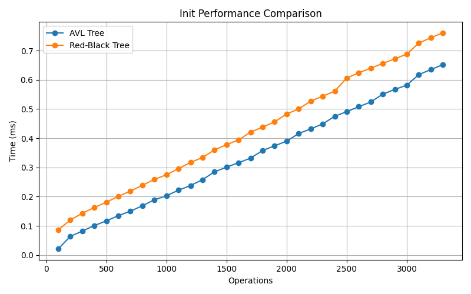

Deletion of 100 words on the AVL tree takes 0.060 ms, while the same operation on the Red-Black tree takes 0.043 ms.

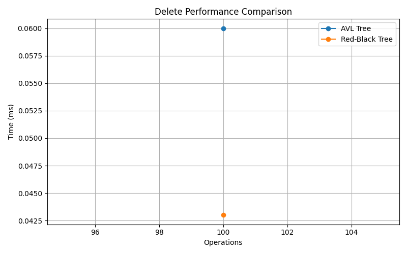

Insertion of 100 words on the AVL tree takes 0.217 ms, while the same operation on the Red-Black tree takes 0.065 ms.

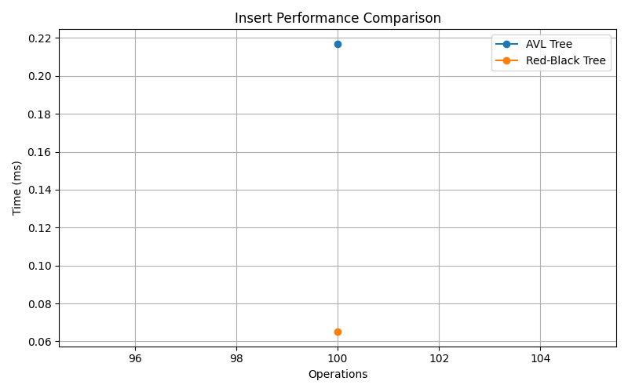

It seems that the Red-Black tree is not always faster than the AVL tree.

<br>

The project specification says that "after each operation on 100 pieces of data, you should record the time used". It does not require repetition to avoid randomness, either. In addition, `delete.txt` and `insert.txt` both only contained 100 lines of data. Measuring the overall time cost of these operations does not make much sense. Therefore, a revised version of the benchmark, `test100.cpp`, is implemented to measure the time cost every 10 pieces of data. The test is carried out 100 times. The result is saved in `time_log.csv` and `average_time.csv`.

<!-- @import "test100.cpp" -->

The Python program used to generate the plots is revised as follows.

<!-- @import "analysis100average.py" -->

The following three figures show that the Red-Black tree outperforms the AVL tree in all cases, which is expected. 

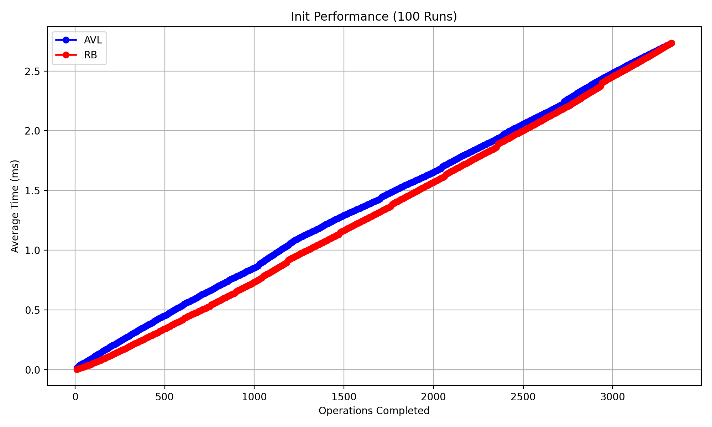

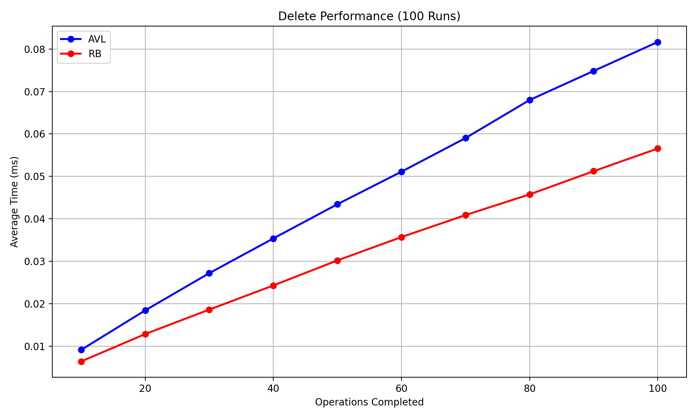

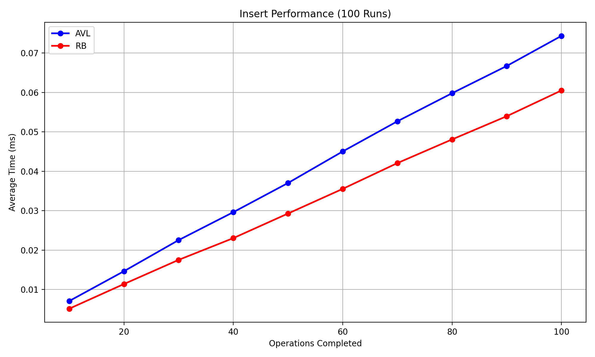

Both Red-Black tree and AVL tree insertion and deletion operations take `O(lgn)` time in theory. As is indicated by the differences of the slope in the plots, Red-Black tree is faster than AVL tree by a constant factor. Although both are balanced trees, AVL trees maintain stricter balance, while Red-Black trees allow more flexibility and therefore perform fewer rotations. Operations on Red-Black tree are relatively local. On the other hand, fixing a violation of the AVL tree property may require operations from the bottom of the tree to the root node in the worst case.

Note that the time in the first three plots are cumulative, so the plots exhibit a straight line. The next three figures are the time cost during each interval.

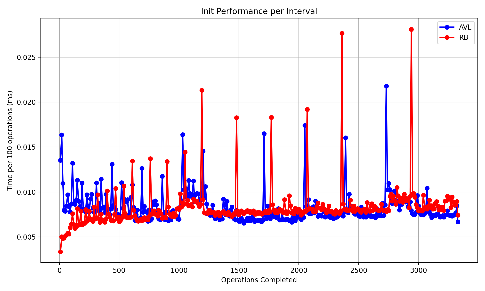

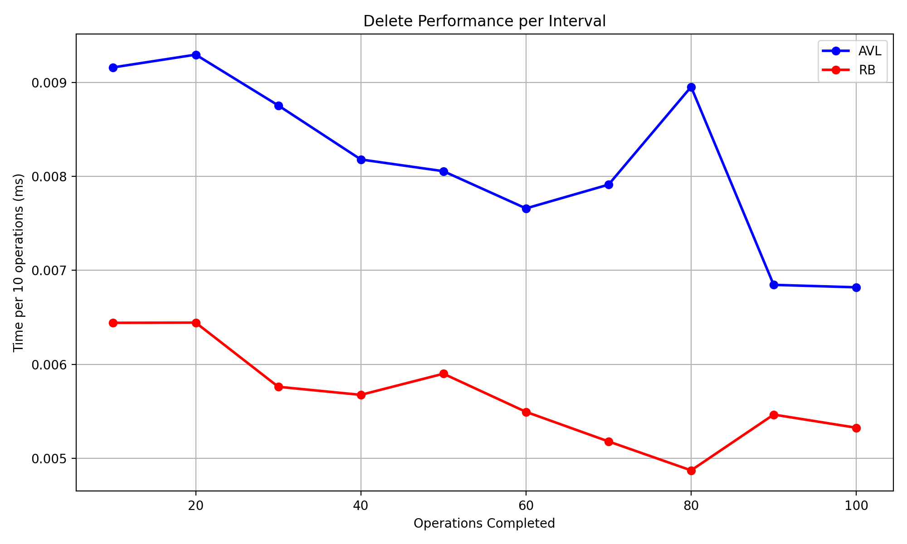

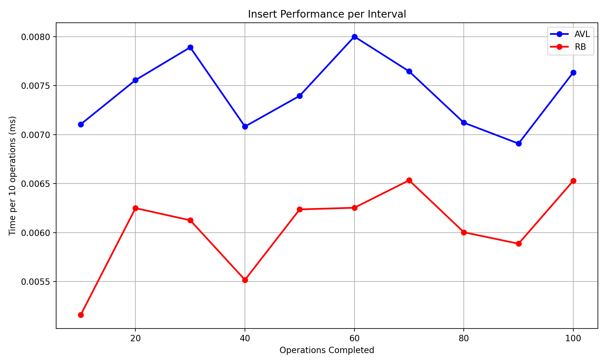

<br>

## Discussion

This project, however, has many limitations.

First, the experiment lacks a precise methodology of measuring the performance of an algorithm. On a sophisticated operating system like Windows 11, background processes may introduce noise that undermines the precision of millisecond-level timing. Operating system scheduling and background processes introduce timing noise that is difficult for programmers to control. In other words, the performance of the algorithms presented by the experiment merely indicates an ambiguous trend. This problem appears in almost all our projects.

In addition, the dataset used in initialization, deletion, and insertion remains fixed across all runs. Both trees evolve into almost identical structural shapes on every trial, regardless of how many times the benchmark is executed. This limits generalizability, since real workloads involve evolving and unpredictable inputs. The advantage of Red-Black tree may become more noticeable in real-world scenarios.

Due to the relatively fixed tree structure, the resulting plots rarely capture the expected logarithmic performance trend. There are several points that deviate noticeably from the trend. The occasionality of the bad cases cannot be eliminated by repeated testing on the same data, making these figures quite confusing. It is advisable to generate a random set of words to delete and insert during every run of the experiment.

<br>

## Conclusion

This project demonstrates the full implementation of AVL and Red-Black trees, along with functionality for insertion, deletion, range queries, and structural visualization. The benchmark framework measures the running time of common operations and provides plots to compare the behavior of the two data structures. The results generally align with theoretical expectations: both trees exhibit `O(lgn)` time complexity, with AVL trees maintaining stricter balance and Red-Black trees performing fewer structural adjustments.

<br>

## References

Cormen, T. H., Leiserson, C. E., Rivest, R. L., and Stein, C. (2022).
    *Introduction to Algorithms* (4th ed.). MIT Press.

<br>

## Acknowledgement

ChatGPT-5 provided valuable suggestions about measuring the running time in C++ and correcting spelling mistakes in my writing.

> https://chatgpt.com/s/t_68d1f697dc9c8191aab672cd50b08c5f
> https://chatgpt.com/s/t_691b35ed78048191ab87a80359475d68